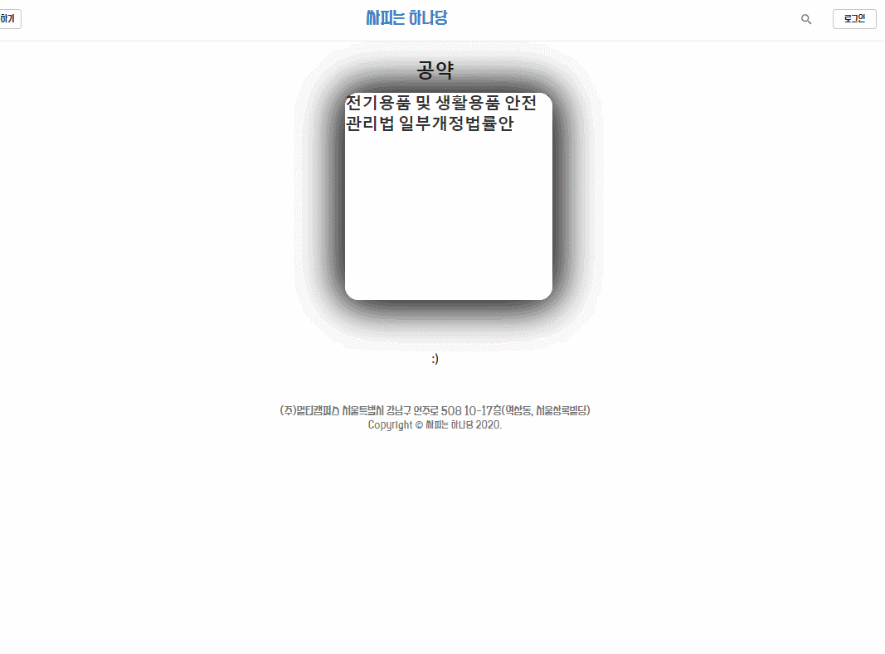

# :statue_of_liberty: 싸피는하나당 :statue_of_liberty: 
[](https://www.npmjs.com/package/react)
> 선거의 관심도를 높이기 위한 선거정보 제공사이트


선거 출마의원들과 국회의원을 소개하는 웹사이트입니다. <br>
한 눈에 정보를 확인할 수 있는 UI와 정치이상형월드컵, 자신의 성향을 파악할 수 있는 게임들이 특징입니다.

 * V1.0.0
 <주요기능>
  -
  -
  -
  -

<br>

## :gear: 개발 환경 설정

배포
```
git clone https://lab.ssafy.com/webmobile1-sub2/s02p12a308.git
cd s02p12a308

/* client build */
cd client
yarn run build

/* server 프로젝트 하단의 src/main/resource/ 아래 폴더에 templates와 static 부분을 채워주세요. */

/* server build */
/* maven을 package로 build한 후 server프로젝트 하단의 target 디렉토리에서 jar파일을 찾아 실행해주세요*/
java -jar SsafyOne.0.0.1v.jar

```

프로젝트 실행
```sh
git clone https://lab.ssafy.com/webmobile1-sub2/s02p12a308.git
cd s02p12a308
/* client 실행 */
cd client
npm install
npm start

/* server 실행 */
cd server
/* 메이븐 install 후 실행해주세요 */

```

<br>

## :hammer_and_pick: 개발 스택

**Front**

- React v16.12.0 (create-react-app / not using webpack)
- Redux v4.0.5
- 환경 Windows 10 / Visual Studio Code

**Server**

- Spring Boot v2.2.2
- JPA
- JWT
- 환경 Windows 10 / eclipse (STS4)

<br>

## :earth_asia: 기능 소개

### 1. 회원가입 유효성 검사

이메일, 비밀번호 regex 적용 <br>
중복확인 및 비밀번호 확인 상태변수 파악 후 회원가입 가능
<br>
### 2. 정치이상형 월드컵 카드게임

@react swipe cards 이용
<br>
### 3. 정치인 정보 열람 (무한스크롤) 

네이버 @egjs/react-infinitegrid 이용
<br>
### 4. 정치성향 검사

<br>
### 5. 후보자 살펴보기
 


<br>


## :calendar: 프로젝트 작업 스케줄 ( 2020.01.13 ~ 02.18)

==============6주차==============
* 02.18.2020
    * <b> :star: 싸피는 하나당 v1.0.0 배포</b>
    * Front / Server Project Refactoring
* 02.17.2020
    * Front-Back build path 수정 및 배포 준비
    * 구현 : (front) 의안 / 공약 보여주기, 국회의원 detail 수정

==============5주차==============
* 02.14.2020
    * 구현 : (front) 출마의원 보러가기 기능 구현 - 출마의원 comment 구현
    * 스터디 : react build, spring build 방법, 배포방법 스터디
* 02.13.2020
    * 구현 : (front) 기존 기능 CSS 점검
    * 구현 : (front) 국회의원 검색 기능 redux구조 적용 구현
* 02.12.2020
    * 구현 : (front) Comment 기능 개발
    * 구현 : (front) 국회의원 리스트 수정
* 02.11.2020
    * 스터디 : (back) 소셜로그인 스터디
    * 구현 : (front) 국회의원 리스트 redux구조로 refactoring
* 02.10.2020
    * 구현 : (back) board rest API 작성
    * 구현 : (front) board CRUD 적용

==============4주차==============
* 02.07.2020
    * 구현 : (back) 랜덤 추출 기능 개선
    * 구현 : (front) 정치인 월드컵 개선사항 적용
    * 스터디 : JPA paging / Redux
* 02.06.2020
    * 구현 : (back) 카카오 로그인 API 적용
    * 구현 : (back) 랜덤 추출 기능 추가
    * 구현 : (front) 정치인 월드컵 개선사항 적용
    * 스터디 : Redux
* 02.05.2020
    * 구현 : (back) 게시판, 국회의원, LIKE entity CRUD
    * 스터디 : Oauth / Redux
* 02.04.2020
    * 구현 : (front) 정치성향 테스트 2차 개발
* 02.03.2020
    * 구현 : (front) 사이드바 추가, 폰트 변경

==============3주차==============
* 01.31.2020
    * 구현 : (front) 정치성향 테스트 1차 개발
* 01.30.2020
    * 구현 : (back) 국회의원, 의안, 공약 크롤링 완료
    * 구현 : (back) Polition, Promise, bill RestAPI 완료
* 01.29.2020
    * 수정 : (front) 정치공약 이상형 월드컵 - 카드게임 움직임 에러 수정
    * 수정 : (front) 앞단 로그인, 회원가입 유효성 검사 완료
* 01.28.2020
    * 구현 : (front) 무한스크롤링을 사용하여 국회의원 정보 페이지

==============2주차==============
* 01.23.2020
    * 구현 : (back) user RestAPI 완료
* 01.22.2020
    * 구현 : (back) JWT 토큰 발행 완료
    * 기능 : (front) 정치공약 이상형 월드컵 - 카드게임 1차 완료
    * 구현 : (front) 정치인 상세페이지 구현
* 01.21.2020
    * 구현 : (front) 로그인 / 회원가입 페이지 구현
* 01.20.2020
    * (back) 환경설정 완료
    * 구현 : (front) 메인 페이지 구현

<br>

## :busts_in_silhouette: 정보

### SSAFY 2기 Seoul Web 3반 <br>
**팀장 : 임희선**<br>
팀원 : 김은수, 박지홍, 이훈

<br>

## 라이센스

 @copyright Samsung Software Academy